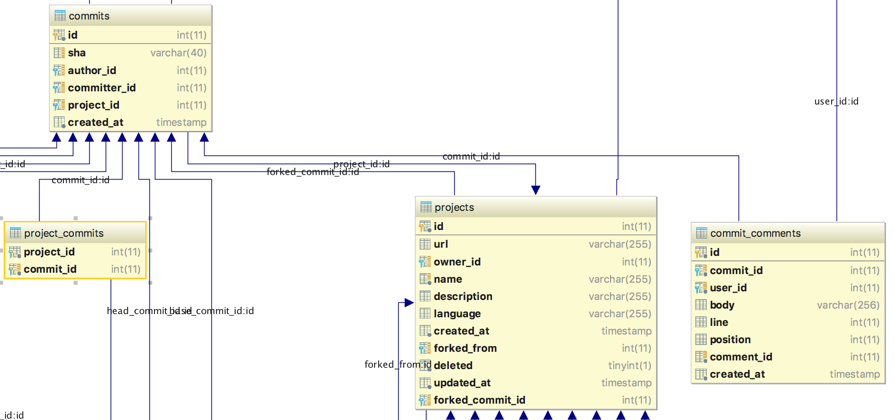
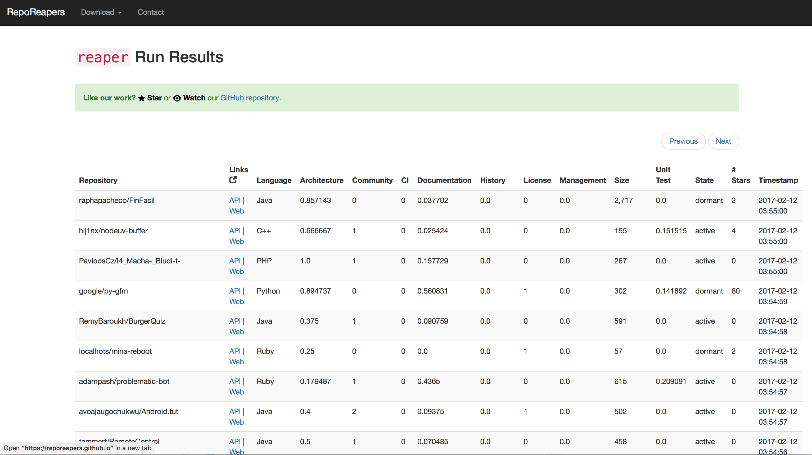

```{r setup, include=FALSE}
knitr::opts_chunk$set(echo = FALSE)
knitr::opts_knit$set(sql.max.print = 5)

# Setup DB connection for use in the code blocks below
library(DBI)
db <- dbConnect(RSQLite::SQLite(), dbname = "rxjs-ghtorrent.db")
```

## GitHub and their data

With 40M repos and 15M users, [GitHub](http://github.com) is the largest source
code archive and one of the largest online collaboration platforms on the
planet.

For software engineering researchers, GitHub is valuable because:

* It has an extensive API: [api.github.com](https://api.github.com)
* It exposes both process and product data
* All data are highly interconnected

## GitHub's API

Contains all data from all public repositories

* *Events*: A real-time endpoint of all things happening on GitHub

* *Entities*: Represent the state of a resource at the time of query

* *Graphs*: Query entities in a depth-first fashion (new!)

## Ways of accessing GitHub data

* [REST API / GraphQL](https://developer.github.com)
* [GitHub Archive](http://githubarchive.org) Collects GitHub events and offers
them over BigQuery
* [Github on BigQueury](https://cloud.google.com/bigquery/public-data/github)
The source code of all public GitHub repos along with metadata on BigQuery.
* [GHTorrent](http://ghtorrent.org) Collects GitHub events, resolves all
entities linked from those and creates a relational view. Data is offered as
downloads, online access services or over BigQuery.

## The REST API

The REST API allows us to browse entities given a known starting point

```{bash, echo=T, eval=F}
# Find Microsoft's 5 most starred repos
curl -s "https://api.github.com/orgs/microsoft/repos?per_page=100&page=1" |
jq 'sort_by(.stargazers_count) |.[] | [.name, .stargazers_count] | @csv'|
sed -e 's/^"\(.*\)"$/\1/' |tr -d '\' |
tail -n 5
```
```
## "referencesource",1207
## "cpprestsdk",1585
## "TypeScriptSamples",1825
## "dotnet",8031
## "TypeScript",20824
```

* An API key is needed, 5k reqs/hour
* Always use in combination with `per_page=100`
* Too fine-grained for many MSR tasks

## GraphQL API

GraphQL API allows us to query entities and their dependents in one go

```javascript
{
  user(login: "dhh") {
    name
    location
    organizations(first:10) {
      nodes {
        name
        repositories(first: 20) {
          nodes {
            name
          }
        }
      }
    }
  }
}
```

https://developer.github.com/v4/explorer/

## GitHub Archive

{width=90%}

Collects all GitHub **events** since late 2011, allows querying over Google
BigQuery.

## GitHub data on BigQuery

An updating snapshot of both code + metadata for 2.5M repos.

What are the most popular testing frameworks for Python?

```sql
SELECT lib, count(*) AS count
FROM (
  SELECT REGEXP_EXTRACT(versions, r"(\w*)") as lib
  from (
    SELECT first(split(c.content, '\n')) as versions
    FROM (
        SELECT *
        FROM [bigquery-public-data:github_repos.files]
        WHERE path contains 'requirements.txt'
      ) AS f
      JOIN
         [bigquery-public-data:github_repos.contents] c on f.id = c.id
    ) AS v
  WHERE REGEXP_MATCH(versions, "[>=]=[0-9]*")
) AS l
GROUP BY lib
ORDER BY count DESC
```

## GitHub data on BigQuery

Which repos are affected by our vulnerability disclosure (Operation Rosehub)?

```sql
SELECT pop, repo_name, path
FROM (
  SELECT id, repo_name, path
  FROM `bigquery-public-data.github_repos.files` AS files
  WHERE path LIKE '%pom.xml' AND
    EXISTS (
      SELECT 1
      FROM `bigquery-public-data.github_repos.contents`
      WHERE NOT binary AND
        content LIKE '%commons-collections<%' AND
        content LIKE '%>3.2.1<%' AND
        id = files.id
    )
)
JOIN (
  SELECT
    difference.new_sha1 AS id,
    ARRAY_LENGTH(repo_name) AS pop
  FROM `bigquery-public-data.github_repos.commits`
  CROSS JOIN UNNEST(difference) AS difference
)
USING (id)
ORDER BY pop DESC;
```

Checkout the work of [Felipe Hoffa](https://medium.com/google-cloud/github-on-bigquery-analyze-all-the-code-b3576fd2b150)

## GHTorrent

GHTorrent collects all data, both events and entities, from the GitHub REST API
and makes them available:

* As queriable [MySQL](http://ghtorrent.org/mysql.html) and
[MongoDB](http://ghtorrent.org/raw.html) databases
* As [database dumps](http://ghtorrent.org/downloads.html) for both databases
* Over Google [BigQuery](https://bigquery.cloud.google.com/dataset/ghtorrent-bq:ght_2017_01_19) (MySQL data only)
* As continuously updating data streams (also, over [Google Pub/Sub](https://console.cloud.google.com/cloudpubsub/topicList?project=ghtorrent-bq) )

## Some statistics about GHTorrent

* $>$ 15TB of MongoDB (raw) data
* $>$ 5B rows in MySQL
* 140k API reqs/hour
* 70+ users donated API keys
* 300 users, from > 200 institutions have access
* 100+ papers
* $>$ 40% of all GitHub-related papers (Cosentino et al.)

## Growth

This is how fast MongoDB grows ($\times$ 1M)

| Entity| 2013 | Feb 2016 | Apr 2017 | $\Delta$ 2016 - 2017 |
|:----- |:----:|:----:|:----:|:--------------------:|
|Events | 43 | 476 | 886 | 1.9$\times$  |
|Users | 0.7 | 6.7 | 13.5 | 2$\times$|
|Repos | 1.3| 28 | 57 | 2$\times$ |
|Commits | 29.9 | 367 | 662 | 1.8$\times$ |
|Issues | 2.3 | 24.1 | 41.1 | 1.7$\times$ |
|Pull requests | 1.1 | 11.9 | 23.8 | 2$\times$ |
|Issue Comments | 2.8 |42 | 74.2 | 1.7$\times$ |
|Watchers | 7.7 | 51 | 84.9 | 1.6$\times$ |

GitHub/GHTorrent doubled its size during the last 14 months!

## Data collection

{ width=80% }

GHTorrent follows the event stream and recursively retrieves linked
entities.

## Distributed operation

{ width=90% }

* _Event retrieval_ nodes query the event API
* _Data retrieval_ nodes apply the recursive descent retrieval process
    * One API key per data retrieval node

## Collection modes

* **Normal operation**: Follow the event timeline, apply dependency-based retrieval
* **Periodic updates**: Refresh the state of all repos/users (cater for deleted repos, changed user locations etc)
* **Full retrievals**: Get all info for a repo/user, in case some information is missing

## The MySQL schema


{ width=80% }

## Important tables -- Users
{ width=30% }

* Type: USR or ORG
* Fake users represent emails with corresponding GitHub account
* ~15% users are geo-located
* Emails and real names not distributed by default

## Important tables -- Projects & Commits
{ width=60% }

* A fork has a non-NULL `forked_from` and `forked_commit_id`
* `language` in projects represents the primary language at collection time. More details in table `project_languages`
* A commit is only stored once per SHA
* The table `project_commits` links commits to projects

## Important tables -- Pull Requests

* If `head_repo_id` is null $\rightarrow$ the fork was deleted
* Entries in `pull_request_history` represent a log of actions on a PR
* PRs and issues are dual on GitHub
    * The PR history is also reflected in `issue_events`
* A PR is associated with 3 times of comments:
    * `issue_comments`: The PR/Issue discussion
    * `pull_request_comments`: PR-global code review comments
    * `commit_comments`: Line-local code review comments
* A PR has associated `pull_request_commits` (not retrievable in case of rebases)

##  SQL Schema: Things to remember

* The info in `organization_members` and `project_members` is not trustworthy,
as it is optional for orgs/projects to publish it
* `watchers` means GitHub stars
* `watchers` and `followers` are append-only tables (GitHub does not emit events on delete/update)
* `followers` is only updated during periodic updates, as GitHub stopped emitting
`FollowEvent`s
* The timestamps in `followers` and `watchers` were relative to the time of
retrieval. Since mid-2015 they are accurate.

## Querying the SQL schema

Let's query!

To make queries shorter, we use the following project

```{sql, connection=db, echo=T}
select p.id, u.login, p.name
from projects p, users u
where u.id = p.owner_id
  and u.login = 'ReactiveX'
  and p.name = 'rxjs'
```

## Get all commits
```{sql, connection=db, echo=T}
select u.login as author, c.sha, c.created_at
from users u, commits c, project_commits pc
where pc.commit_id = c.id
  and pc.project_id = 1
  and u.id = c.author_id
order by c.created_at desc
```

## Basic info about forks

```{sql, connection=db, echo=T}
select u.login, p.name,  p.forked_commit_id
from projects p, users u
where p.forked_from is not null
and u.id = p.owner_id
order by p.id desc
```

## Get all commits for a fork (1)
```{sql, connection=db, echo=T}
select c.id, u1.login as author, c.sha, c.created_at
from projects p, users u, users u1, commits c, project_commits pc
where pc.commit_id = c.id
  and pc.project_id = p.id
  and u1.id = c.author_id
  and u.id = p.owner_id
  and u.login = 'herflis'
  and p.name = 'rxjs-1'
order by c.created_at desc
```

**Q**: Why do we only get 2 commits?

## Get all commits for a fork (2)

What the previous query returns is a list of commits up to the fork point.
We also need to retrieve the base repository commits up to the fork point.

First, we get some information to make querying simpler

```{sql, connection=db, echo=T}
select p.id, p.forked_from, p.forked_commit_id
from projects p, users u
where u.id = p.owner_id
  and u.login = 'herflis'
  and p.name = 'rxjs-1'
```

## Get all commits for a fork (3)
```{sql, connection=db, echo=T}
select id, author, sha, created_at
from (
  select c.id, u1.login as author, c.sha, c.created_at
  from users u1, commits c, project_commits pc
  where pc.commit_id = c.id
    and pc.project_id = 450
    and u1.id = c.author_id
  union
  select c.id, u1.login as author, c.sha, c.created_at
  from users u1, commits c, project_commits pc
  where pc.commit_id = c.id
    and pc.project_id = 1
    and u1.id = c.author_id
    and c.created_at <
      (select created_at from commits where id = 3)
) as commits
order by created_at desc
```

## Which forks contributed code?
```{sql, connection=db, echo=T}
select cr.month as month, cr.created, co.contributing
from (
  select date(p.created_at,'start of month','+1 month','-1 day')  as month,
         count(*) as created
  from projects p
  where p.forked_from = 1
  group by month) as cr
join
  (select date(p.created_at,'start of month','+1 month','-1 day') as month,
         count(*) as contributing
  from projects p
  where p.forked_from = 1
  and exists (
    select *
    from pull_requests pr
    where pr.head_repo_id = p.id)
  group by month) as co
on cr.month = co.month
order by month desc
```

## What are the core team members?
```{sql, connection=db, echo=T}
select distinct(u.login) as login
    from commits c, users u, project_commits pc
    where u.id = c.committer_id
      and u.fake is 0
      and pc.commit_id = c.id
      and pc.project_id = 1
      and c.created_at > datetime(date('2017-02-14'), '-3 month')
union
select distinct(u.login) as login
  from pull_requests pr, users u, pull_request_history prh
  where u.id = prh.actor_id
    and prh.action = 'merged'
    and prh.pull_request_id = pr.id
    and pr.base_repo_id = 1
    and prh.created_at > datetime(date('2017-02-14'), '-3 month')
```

## Which countries contributed most commits?

```{sql, connection=db, echo=T}
select u.country_code, count(*) num_commits
from users u, commits c
where u.id = c.author_id
  and country_code is not null
group by u.country_code
order by num_commits desc
```

## Tips for using GHTorrent effectively

* Use MySQL for queries
    * Downloading and install a local copy is **recommended**
* Only use MongoDB when you need:
    * Text for issue comments, commit messages, commit diffs
    * Connect to the online service
    * Don't do aggregations on MongoDB, prefer [index-based](http://ghtorrent.org/raw.html) queries
* Use BigQuery for large aggregations
    * Also possible to combine with the GitHub dataset

## Combining MongoDB and MySQL data

"Use the `bash`, Luke"

```bash
echo "select c.sha \
      from commits c, project_commits pc \
      where pc.commit_id = c.id and \
      pc.project_id = 1;" |
sqlite3 rxjs-ghtorrent.db|
while read sha; do
  echo "db.commits.find({sha: '$sha'},{'commit.message':1, _id:0})" |
  mongo --quiet github|
  jq '.commit.message'|
  xargs echo $sha
done
```

* MySQL is basically a 2D index to MongoDB
* Most useful information in MongoDB is in the `commits` collection

## Use BigQuery to join public datasets

```sql
SELECT c.country, COUNT(*) pushes, 
  FIRST(c.population) population,
  1000*COUNT(*)/FIRST(c.population) ratio_pushes
FROM [githubarchive:month.201608] a
JOIN [ghtorrent-bq:ght_2017_05_01.users] b
ON a.actor.login=b.login
JOIN (
  SELECT LOWER(iso) iso, population, country
  FROM [gdelt-bq:extra.countryinfo]
  WHERE population > 300000
) c
ON c.iso=b.country_code
WHERE country_code != '\\N'
AND a.type='PushEvent'
GROUP BY 1
ORDER BY ratio_pushes DESC
```

## Real-time data analysis
```ruby
conn = Bunny.new(:host => '127.0.0.1', :port => 5672,
                 :username => 'streamer', :password => 'streamer')
conn.start
ch = conn.create_channel
exchange = ch.topic('ght-streams', :durable => true)
q = ch.queue('gousiosg_queue', :auto_delete => true)
q.bind(exchange, :routing_key => 'ent.commits.insert')

q.subscribe do |delivery_info, properties, payload|
  commit = JSON.parse(payload)
  repo = commit['url'].split(/\//)[4..5].join('/')
  commit['files'].each do |f|
    next unless /passw[or]*d.*[:=].*/.match? f['patch']
    puts "Password found! repo=#{repo}, sha=#{commit['sha']}"
  end
end
```

Get updates from GHTorrent in a streaming fashion.

## Avoiding common pitfalls

* GHTorrent (or any GitHub dataset) is not an exact GitHub replica

You can retrieve a set of data and write scripts to fill in the gaps
using the GitHub API/GraphQL.

* Don't select repositories to analyze manually

This will lead to non-representativeness. Define a population first,
then use _stratified sampling_ to select repositories from it.

## Avoiding common pitfalls

* Repositories are not projects

A large project, such as Homebrew, is usually composed of multiple
repositories. Some repositories have equally active forks.
To study a _project_ as a community, make sure you include all its
related activity.

* Most repositories are idle

Selecting randomly from repositories will lead to toy/dead repositories.

## Avoiding common pitfals

* Many active projects do not use GitHub exclusively

The prime example are Apache projects. Projects with with high
commit counts but not so many issues/pull requests are using other collaboration
platforms.

* Not all activity is due to users

Beware of bots and tool integrations, especially in issues and pull requests!

{ width=90% }

## Avoiding common pitfals
* At least 15% of merged pull requests appear as not merged

Use the following heuristics to uncover them

1. An entry in table `pull_request_commits` also appears in `project_commits`
2. A commit in `project_commits` references a PR number (e.g. `fixes: 12`)
3. One of the 3 last comments in the discussion match following regex
`(?:merg|appl|pull|push|integrat)(?:ing|i?ed)`
4. The above regex matches the last comment before closing the PR

## Selecting repositories to analyze

Generally, we need repositories that are active and representative. We can
use the following selection process:

From the whole population:

1. Choose repositories that have forks ($A$)
2. from $A$, exclude repos that where inactive _recently_ ($B$)
2. from $B$, exclude repos that never received a PR ($C$)

On $C$, we can then apply further criteria (e.g. programming language,
build system, minimum number of stars etc).

If the project list is still too long, then apply _stratified sampling_

## Reporeapers

A curated set of repositories worth analyzing

{ width=90% }

## Legal issues

```javascript
{
    "id": "4141500869",
    "type": "IssueCommentEvent",
    "actor": {},
    "repo": {},
    "payload": {
      "action": "created",
      "issue": {
        "title": "Issue in CopyrightedProjectName",
        "user": {},
        "labels": [],
        "body": "Added data holding classes and a map manager. Will add a system soon"
      },
      "comment": {
        "created_at": "2016-06-14T05:51:16Z",
        "body": "continuing in #141 \r\n"
      }
    }
}
```

**Q:** How many copyrights do you see in the JSON above?

## Copyright situation

{ width=80% }

* We can only assert copyright for non-trivial works
* GHTorrent has a CC-BY-SA license

## Privacy
>**Privacy** is the ability of an individual or group to seclude themselves,
or information about themselves, and thereby express themselves selectively.

To comply with the law, GHTorrent does not distribute privacy-sensitive
information by default.

* Still available by filling in the [Personal data](http://ghtorrent.org/pers-data.html)
form
* Please don't spam developers
* Several ethical considerations, perhaps review your research by your ethics
board

## How to run GHTorrent locally?

Using plain Ruby

```bash
gem install sqlite3 bundler
git clone https://github.com/gousiosg/github-mirror
cd github-mirror
bundle install
mv config.yaml.standalone > config.yaml
ruby -Ilib bin/ght-retrieve-repo -t token rails rails
```

Using Vagrant
```bash
apt-get install vagrant
git clone https://github.com/ghtorrent/ghtorrent-vagrant.git
cd ghtorrent-vagrant
vagrant ssh
ruby -Ilib bin/ght-retrieve-repo -t token rails rails
```

## Contributing to GHTorrent

We need your help!

* Do you have spare hacking time? Pick a task below:
    * Retrieve all commits for non-forked repos
    * Pull request labels
    * Reactions, Issue Timelines
    * More info for repos: licenses, language updates etc
* MongoDB data on BigQuery / Spark
* Do you have a derivative service/dataset? Let's link it!
* Did you find a bug? Let's discuss how to fix it!
* Did you write a paper? Get it included in the [Hall of fame](http://ghtorrent.org/halloffame.html)!

Don't hesitate to contact us: @[gousiosg](https://twitter.com/gousiosg),
@[coolsweng](https://twitter.com/CoolSWEng)

## Further reading
<div id="refs"></div>

## Copyright

This work is (c) 2017 - onwards by Georgios Gousios and Diomidis Spinellis,
licensed under the [Creative Commons Attribution-NonCommercial-ShareAlike 4.0
International](http://creativecommons.org/licenses/by-nc-sa/4.0/) license.
